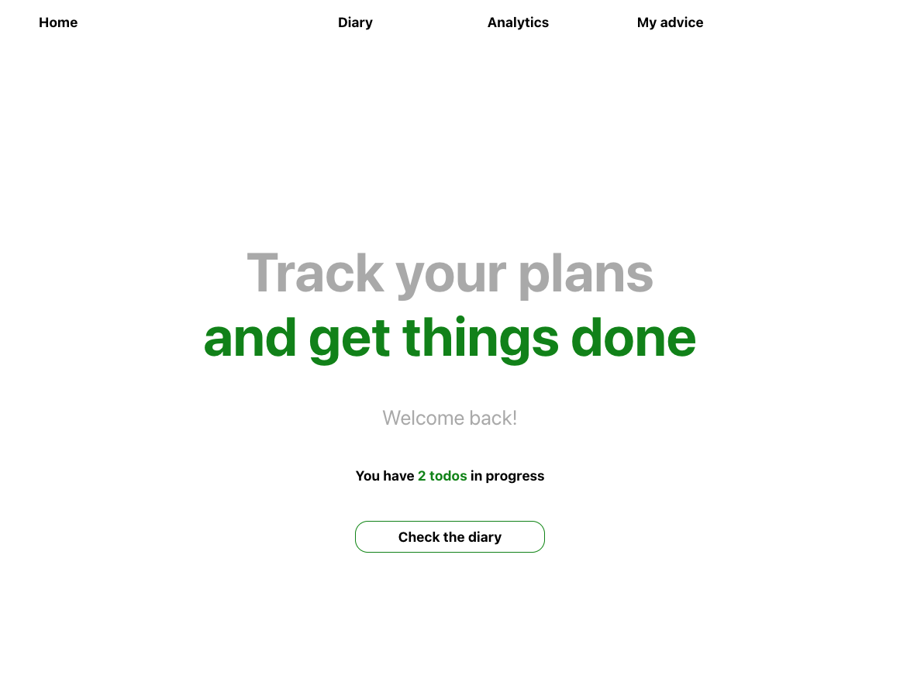
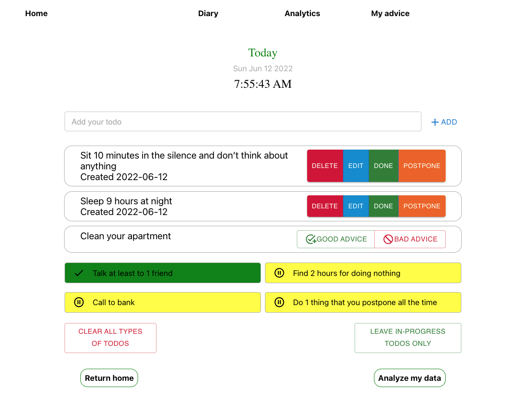
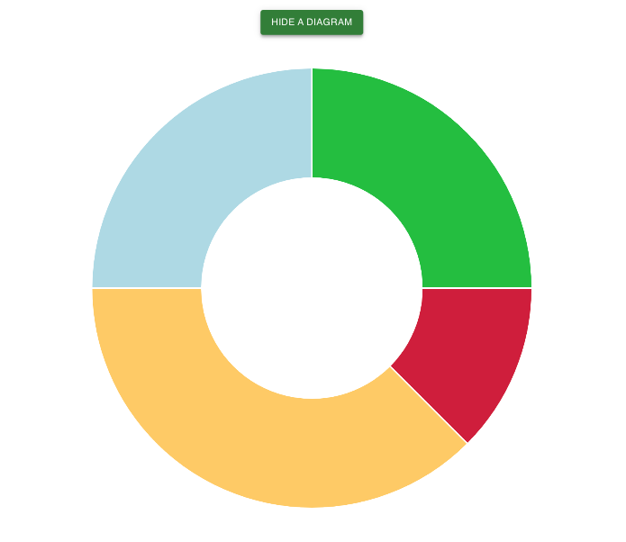
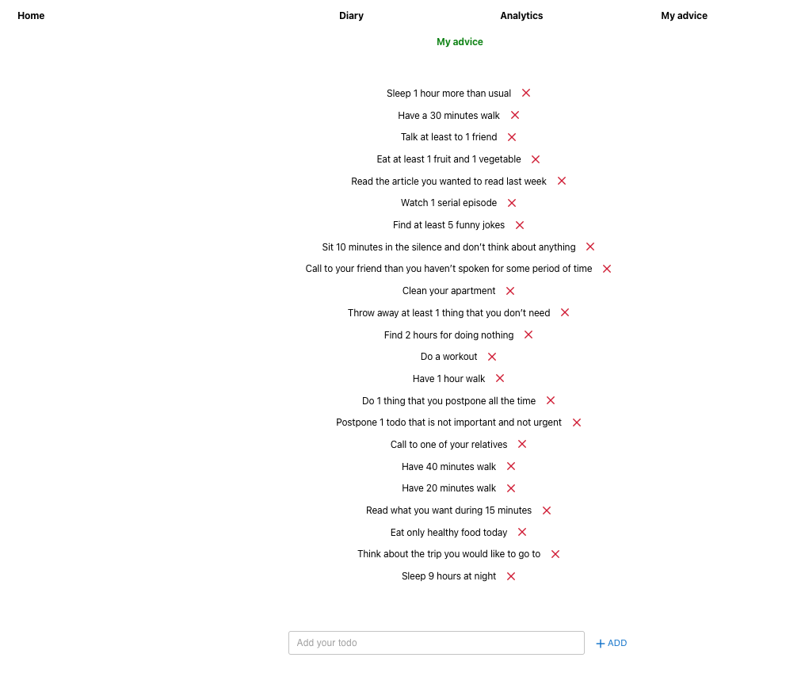

# Personal Diary Project

**CRUD Todo List** with options to mark todos as done, postponed, deleted and analyze results and effectifity.

[Deployment on Netlify](https://julie-cherner-diary-project.netlify.app/)

## Technologies

- React.js
- Redux and Redux Thunk
- SCSS/SASS
- Chart.js
- Materual UI
- Netlify

## Functionality

The application has full CRUD functionality:

- get the amount of todos in progress on the home page
- get a current date and time on the planning page
- get todo advice from the list
- add or delete advice
- add a new todo
- edit new todo content and delete a todo
- mark as postponed/done/deleted and get a todo in a specific list
- get details about all 4 groups of todos
  - in progress
  - deleted
  - postponed
  - done
- get warnings based on the current state of progress (4 types)
- get Pie (Doughnut) Chart Diagram that visualize the structure of 4 groups of todos
- option to clean all todos as well as all todo that are not in progress

## Todos groups and analytics

- **Welcome page with reminder how many todos in progress user has**

- **Todos list area with full CRUD functionality**

- **Analytics and warnings for current todos**

- **Visualization with Diagram (with Chart.js)**

- **List of advice**

